|  | Pemrograman Berbasis Framework 2024 |
|--|--|
| NIM |  2341728026|
| Nama |  Anwar Alif Katresna |
| Kelas | TI - 3A |

## Laporan Pratikum 1:  Membuat Variasi Ukuran Teks Heading dengan Context
> Soal 1  
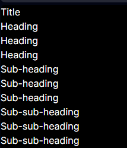

> Soal 2  
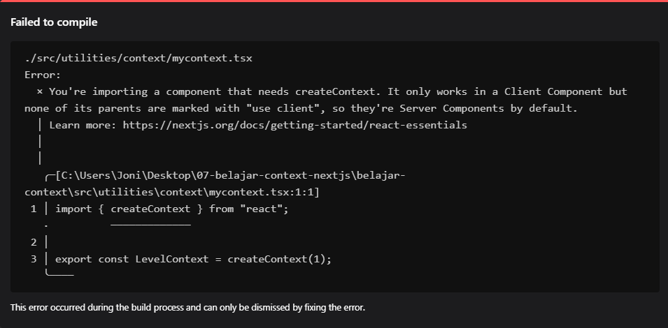  
Error terjadi karena komponen yang diimpor membutuhkan createContext yang hanya bekerja pada komponen klien, namun belum ada parents yang menggunakan use client, sehingga dianggap komponen server secara default. Oleh karena itu, perlu ditambahkan 'use client'; pada file yang mengimpor komponen tersebut.
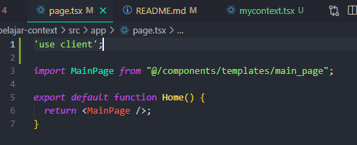  
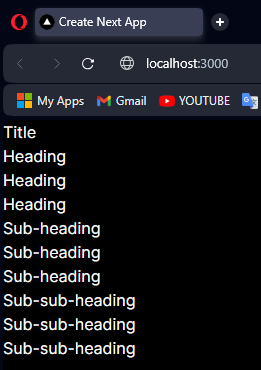  

> Soal 3  
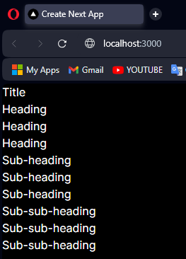  
- Menggunakan useContext untuk Membaca Context. useContext adalah sebuah Hook yang memungkinkan Anda menggunakan nilai dari Context tanpa perlu menulis Consumer. useContext akan membaca nilai dari Context yang Anda berikan (dalam kasus ini, LevelContext).

- Menggunakan Context untuk Menentukan Ukuran Heading. Section menerima children dan menambahkan 1 ke level sebelumnya. Dengan demikian, semua Heading yang berada di dalam Section akan memiliki ukuran yang lebih besar dari Heading yang berada di luar Section.

> Soal 4   
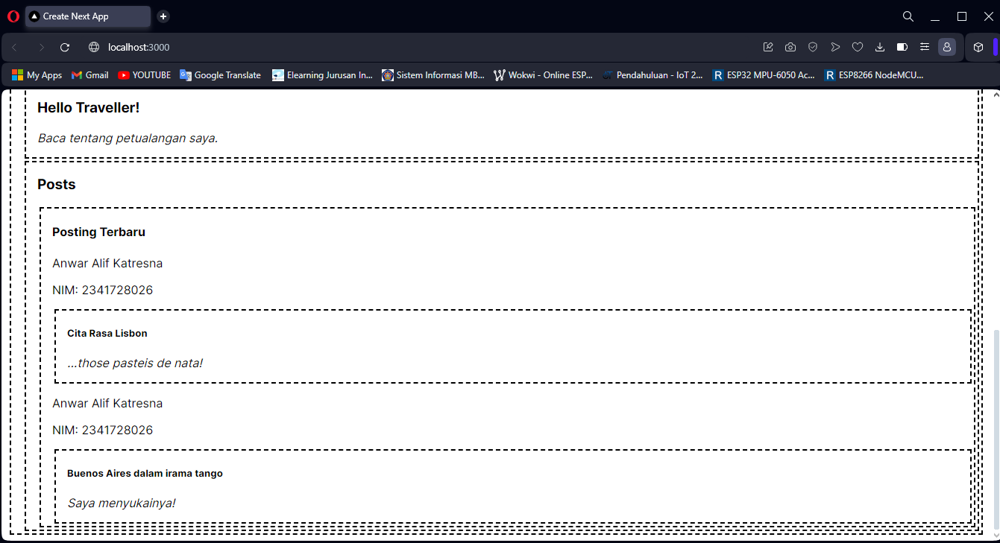 

> Soal 5 Silakan save semua dan lakukan running di browser Anda. Capture hasilnya dan buatlah laporan di README.md. Tambahkan teks Nama dan NIM pada setiap page routing agar menunjukkan itu hasil kerja Anda sendiri!
   
Apakah toggle button tema sudah berfungsi ? jika belum, silakan perbaiki!
Tema sudah berfungsi dengan baik. Ketika tombol toggle ditekan, tema akan berubah dari light ke dark atau sebaliknya.
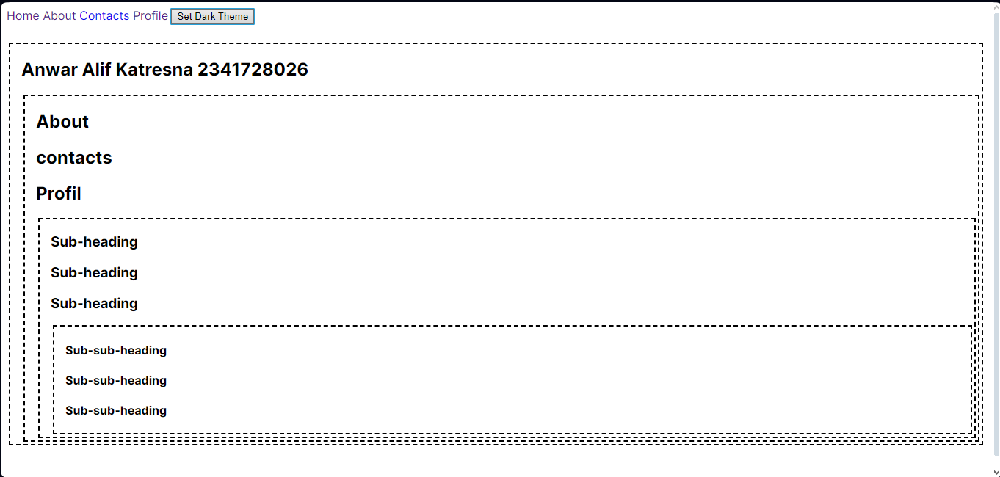 
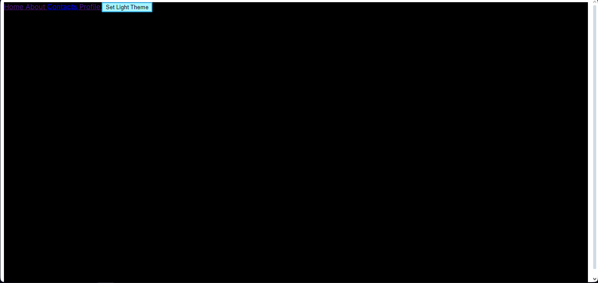 
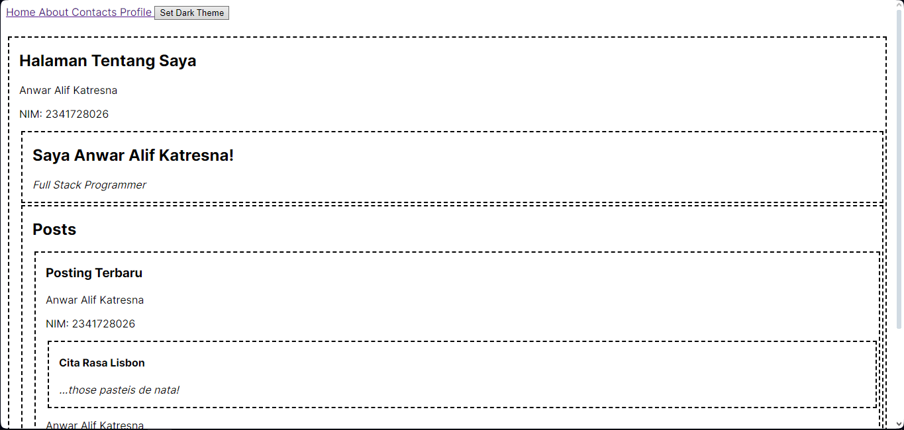 
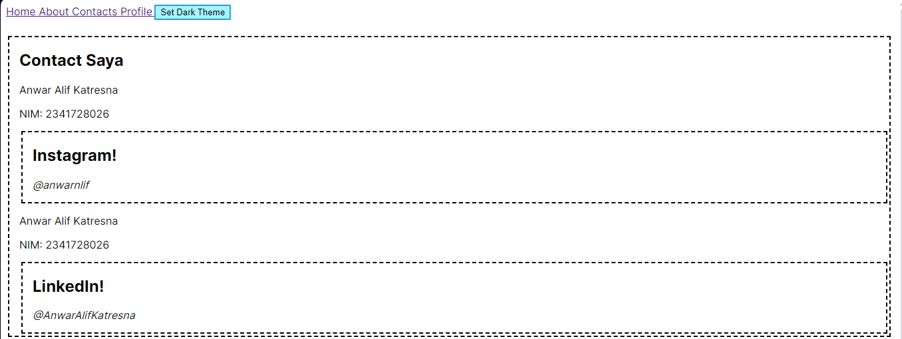 
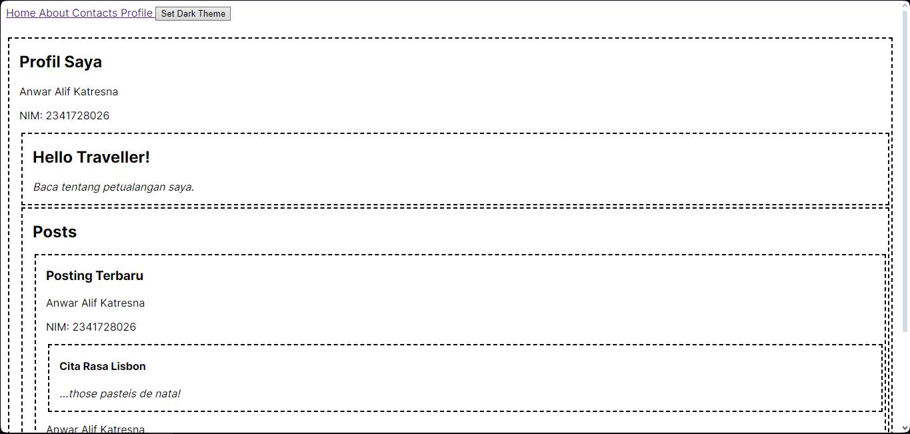

Mengapa ketika refresh atau berpindah halaman tema tidak permanen ? Buatlah menjadi permanen walaupun page sudah direfresh dan pindah halaman!
Ketika halaman direfresh atau berpindah, tema tidak permanen karena state tema tidak disimpan. Untuk membuatnya permanen, dapat menggunakan localStorage untuk menyimpan state tema.

